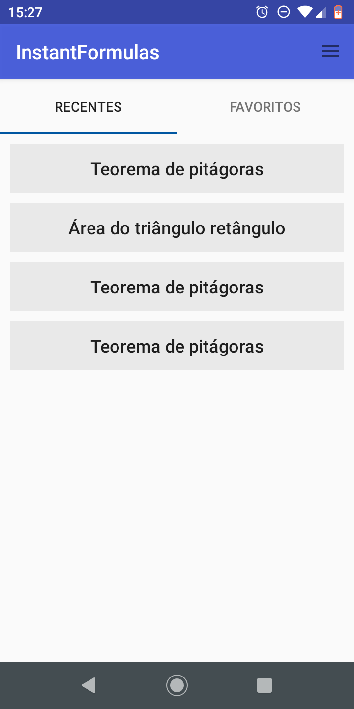
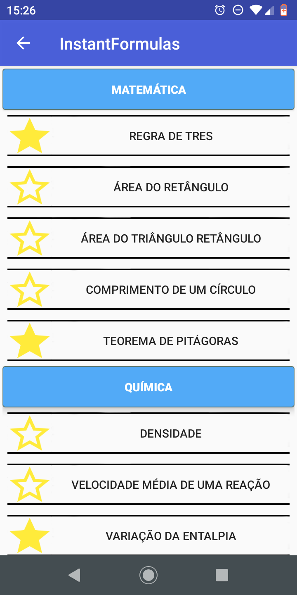
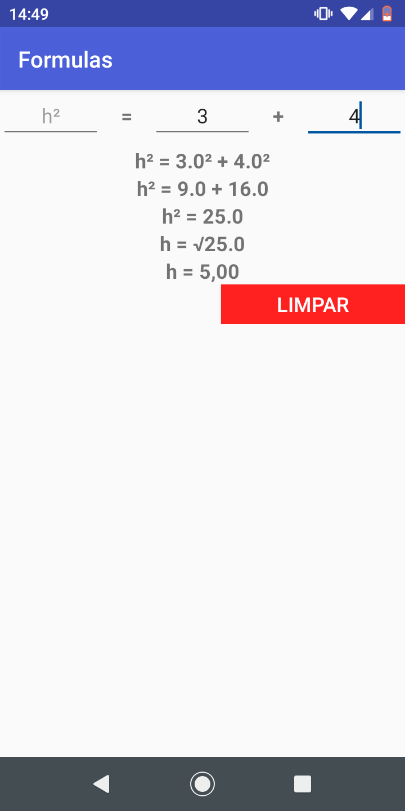
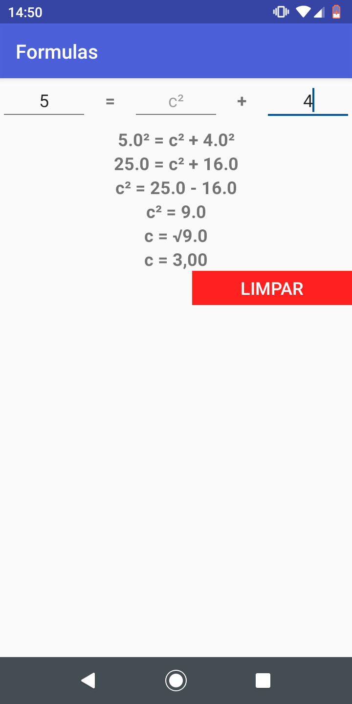

# Aplicativo-de-Formulas

### Descrição ###

Aplicativo que resolve formulas matemáticas, químicas e físicas.
Cada fómula fórmula é resolvida de maneira que a incógnita seja encontrada, portanto um problema pode ser resolvido de várias maneiras diferentes por uma mesma fórmula.

### Imagens do Aplicativo ###

Tela inicial                                                  | Tela principal            |  Favoritos
:------------------------------------------------------------:|:-------------------------:|:-------------------------:
      |   | 

Menu                                                          | Formula exemplo 1         |  Formula exemplo 2
:------------------------------------------------------------:|:-------------------------:|:-------------------------:
   |   | 

### Tecnologias utilizadas ###

Este aplicativo foi desenvolvido em java de forma nativa para android utilizando Android Studio.
